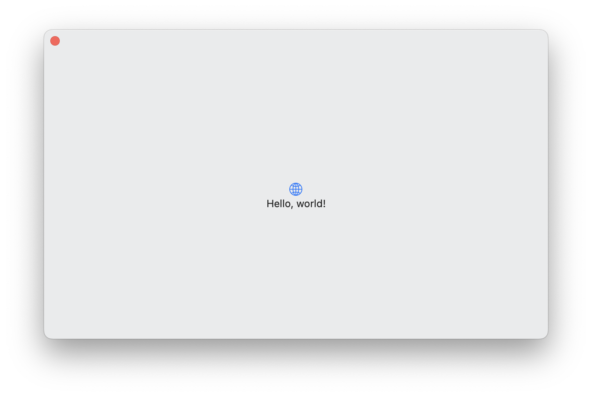

# FramelessWindow


FramelessWindow adds a new window scenes to SwiftUI. Frameless windows are
windows without a titlebar and only the close default button.
Frameless windows are often used as a launcher window, i.e. as Xcode does.

## Usage
Create a window without the title bar and only the close default button.

```swift
import SwiftUI
import FramelessWindow

@main
struct YourApp: App {
    var body: some Scene {
        FramelessWindow(withId: "window-id") {
            ContentView()
        }
    }
}
```

## Adding `FramelessWindow` as a Dependency

To use the `FramelessWindow` library in a SwiftUI project, 
add it to the dependencies for your package:

```swift
let package = Package(
    // name, platforms, products, etc.
    dependencies: [
        // other dependencies
        .package(url: "https://github.com/astzweig/swiftui-frameless-window", from: "0.0.1"),
    ],
    targets: [
        .executableTarget(name: "<command-line-tool>", dependencies: [
            // other dependencies
            .product(name: "FramelessWindow", package: "swiftui-frameless-window"),
        ]),
        // other targets
    ]
)
```

### Supported Versions

The minimum Swift version supported by swiftui-frameless-window releases are detailed below:

swiftui-frameless-window   | Minimum Swift Version
---------------------------|----------------------
`0.0.1 ...`                | 5.7
